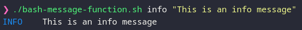

# BASH Message Function

Copy the code from the script if you would like to use it within your script. Another use case is to call the script directly.

```bash
MESSAGE info "This is an info message"
```

```bash
./bash-message-function info "This is an info message"
```


